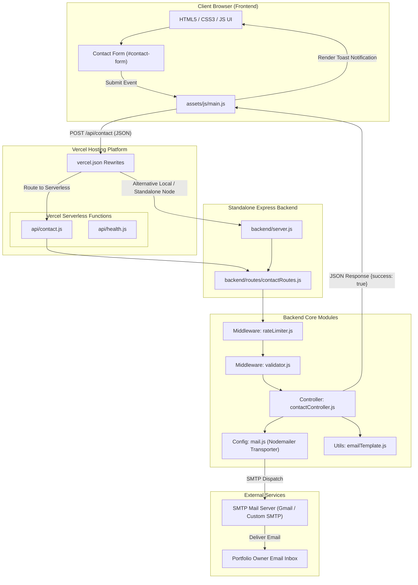

# 🏗️ Architecture & Technical Specification — Varun Joshi Portfolio

> **For AI Agents & Developers**: This document serves as a comprehensive system architecture reference for the **Personal Portfolio Website**. It details the frontend design system, backend API specifications, deployment modes (Vercel Serverless & Express Server), security mechanisms, and data flow.

---

## 📌 1. Executive Summary & Overview

The portfolio is a lightweight, responsive, single-page application (SPA) backed by an asynchronous Node.js email-dispatching microservice.

### Key Architectural Highlights:
* **Zero Heavy Framework Overhead**: Built with pure **HTML5**, **Vanilla CSS3**, and **Vanilla JavaScript (ES6+)** for maximum lighthouse scores, instantaneous page load times, and simple maintenance.
* **Hybrid Dual-Backend Architecture**:
  1. **Vercel Serverless Functions** (`/api/*` endpoints): Zero-config serverless backend deployed alongside the static frontend on Vercel.
  2. **Standalone Express HTTP Server** (`backend/server.js`): Modular Node.js/Express app ready for Docker containers, local development, VPS, Render, or Railway deployment.
* **Automated SMTP Mailer**: Integrated contact form powered by **Nodemailer** with HTML email templates.
* **Production Security**: Multi-layered defense including IP rate-limiting, strict CORS policies, security headers via **Helmet**, input validation/sanitization via **express-validator**, and request payload constraints.

---

## 🛠️ 2. Technology Stack Breakdown

### Frontend Stack

| Layer / Concern | Technology Used | Description & Purpose |
|---|---|---|
| **Structure** | `HTML5` | Semantic elements (`<header>`, `<nav>`, `<section>`, `<footer>`, `<main>`) for SEO & accessibility |
| **Styling** | `Vanilla CSS3` | Custom Design System using CSS custom properties (`:root`), Flexbox, CSS Grid, Glassmorphism, and responsive breakpoints |
| **Scripting / Logic** | `JavaScript (ES6+)` | Client-side DOM manipulation, IntersectionObserver scroll animations, dynamic navbar, AJAX fetch request handling, Toast UI |
| **Typography & Icons**| Google Fonts & FontAwesome 6 | Google Fonts (*Outfit*, *Inter*) for typography; FontAwesome 6 CDN for UI icons |

### Backend Stack

| Module / Tool | Package Name | Version | Description & Function |
|---|---|---|---|
| **Runtime Environment** | `Node.js` | `>=18.x` | Asynchronous event-driven JavaScript runtime |
| **Web Framework** | `Express.js` | `^4.21.2` | Fast, unopinionated routing and middleware handling |
| **Mail Dispatcher** | `Nodemailer` | `^6.10.0` | SMTP client module for transmitting contact emails via Gmail/Custom SMTP |
| **Input Validation** | `express-validator` | `^7.2.1` | Middleware for sanitizing strings, preventing XSS, and validating email formats |
| **Rate Limiting** | `express-rate-limit` | `^7.5.0` | Prevents spam attacks by limiting request rates per IP |
| **HTTP Security Headers**| `Helmet` | `^8.0.0` | Sets secure HTTP headers (XSS Filter, HSTS, Sniff-Guard, etc.) |
| **CORS Manager** | `cors` | `^2.8.5` | Whitelists allowed origin domains (`FRONTEND_URL` and `.vercel.app`) |
| **Request Logging** | `morgan` | `^1.10.0` | HTTP request logging middleware (`combined` in production, `dev` locally) |
| **Environment Config** | `dotenv` | `^16.4.7` | Loads secrets from `.env` into `process.env` |

---

## 📐 3. System Architecture & Component Diagram



---

## 📂 4. Project Directory Structure Map

```
PortFolio/
├── index.html                # Single-page Portfolio Application (HTML5 structure)
├── package.json              # Root Node.js manifest & deployment scripts
├── vercel.json               # Vercel Serverless routing & rewrite configuration
├── LICENSE                   # MIT License
├── README.md                 # Project Overview & Quick Start guide
├── work.md                   # AI Agent & Developer Architecture Master Reference
├── assets/                   # Static Frontend Assets
│   ├── css/
│   │   └── style.css         # CSS Design System, Variables, Responsive Layout
│   ├── js/
│   │   └── main.js           # Client-side Logic, Animations, AJAX Form Handler
│   ├── images/               # Project screenshots, avatars, icons
│   └── resume/               # PDF Resume download file
├── api/                      # Vercel Serverless Functions Entrypoints
│   ├── contact.js            # Express serverless handler for /api/contact
│   └── health.js             # Express serverless handler for /api/health
└── backend/                  # Standalone Express Server & Business Logic
    ├── server.js             # Express server entry point & HTTP listener
    ├── config/
    │   └── mail.js           # Nodemailer SMTP transporter & startup verification
    ├── controllers/
    │   └── contactController.js # Business logic for handling contact submissions
    ├── middleware/
    │   ├── rateLimiter.js    # IP rate limiters (Global: 100/15min, Contact: 5/15min)
    │   └── validator.js      # Express-validator input validation rules
    ├── routes/
    │   └── contactRoutes.js  # Express router endpoints mapping
    ├── utils/
    │   └── emailTemplate.js  # HTML & Plaintext email template generators
    ├── .env                  # Environment variables template / configuration
    └── package.json          # Backend isolated dependencies manifest
```

---

## 🔄 5. Data Flow & Form Submission Sequence

1. **User Action**: The user fills out `name`, `email`, `subject`, and `message` in the frontend contact section of `index.html`.
2. **Client Interception**: `assets/js/main.js` catches the `submit` event, calls `event.preventDefault()`, validates inputs locally, and displays a loading state on the button.
3. **HTTP Request**: An asynchronous `fetch` call issues a `POST` request to `/api/contact` with `Content-Type: application/json`.
4. **Proxy & Routing**:
   * On **Vercel**: `vercel.json` rewrites `/api/contact` to `api/contact.js`, invoking the Vercel serverless function.
   * On **Local / Standalone Express**: `server.js` directly captures `/api/contact` via `contactRoutes.js`.
5. **Security & Rate Limiting**:
   * `helmet` injects security headers.
   * `cors` verifies request origin.
   * `contactLimiter` verifies client IP address has not exceeded 5 requests in 15 minutes.
6. **Validation & Sanitization**: `validator.js` runs `express-validator` rules:
   * `name`: Trimmed, non-empty, min 2 chars, sanitized against XSS HTML tags.
   * `email`: Normalized, validated email format.
   * `subject`: Trimmed, sanitized against script injection.
   * `message`: Trimmed, min 10 chars, max 2000 chars, sanitized.
7. **Email Dispatch**:
   * `contactController.js` processes valid requests.
   * `emailTemplate.js` generates a styled HTML email layout.
   * `mail.js` transports the message using Nodemailer SMTP transporter to `process.env.RECEIVER_EMAIL`.
8. **Response Transmission**: Server returns `HTTP 200 OK` with payload:
   ```json
   {
     "success": true,
     "message": "Thank you! Your message has been sent successfully."
   }
   ```
9. **UI Toast Notification**: `main.js` parses the response, resets the form, and renders a floating success Toast notification.

---

## 🔒 6. Security Features & Implementation

| Security Measure | Implementation Details | Target Risk Mitigated |
|---|---|---|
| **Input Sanitization** | `express-validator` with `.escape()`, `.trim()`, and string length bounds | Cross-Site Scripting (XSS), SQL/NoSQL Injection |
| **Rate Limiting** | `express-rate-limit` (Global: 100 req / 15m; Contact API: 5 req / 15m) | Spamming, Denial of Service (DoS), Mailbox flooding |
| **HTTP Headers Security** | `helmet()` setting HSTS, Frameguard (`X-Frame-Options: DENY`), MIME sniffing prevention | Clickjacking, MIME-sniffing, Protocol downgrade |
| **CORS Policy** | Strict whitelist via `process.env.FRONTEND_URL` + `.vercel.app` regex matching | Cross-Origin Data Theft / Unauthorized API access |
| **Payload Size Guard** | `express.json({ limit: '10kb' })` | Buffer overflow, memory exhaustion payload attacks |
| **Trust Proxy Guard** | `app.set('trust proxy', 1)` | Correct IP resolution when deployed behind reverse proxies (Vercel/Render) |

---

## ⚙️ 7. Environment Variables Reference

Create a `.env` file inside the `backend/` directory (or configure environment variables in Vercel settings):

```env
# Server Configuration
PORT=5000
NODE_ENV=development

# Allowed Frontend URLs for CORS (comma-separated for multiple origins)
FRONTEND_URL=http://localhost:5500,https://varun-joshi.vercel.app

# SMTP Mail Server Configuration
SMTP_HOST=smtp.gmail.com
SMTP_PORT=587
SMTP_SECURE=false

# Sender Credentials (App Password required for Gmail)
EMAIL_USER=joshivarun089@gmail.com
EMAIL_PASS=your_gmail_app_password_here

# Recipient Email Address
RECEIVER_EMAIL=joshivarun089@gmail.com
```

---

## 🚀 8. Execution & Deployment Guide

### Local Development Setup

1. **Install Root & Backend Dependencies**:
   ```bash
   npm install
   cd backend && npm install
   ```

2. **Configure Environment File**:
   Copy `.env` into `backend/.env` and update your SMTP credentials (`EMAIL_USER`, `EMAIL_PASS`).

3. **Start Development Server**:
   ```bash
   # From project root
   npm run dev
   ```
   * The Express API server will listen on `http://localhost:5000`.
   * Open `index.html` via Live Server or browse directly.

### Vercel Serverless Deployment

1. The root repository includes `vercel.json` with API rewrite rules:
   ```json
   {
     "version": 2,
     "rewrites": [
       { "source": "/api/contact", "destination": "/api/contact.js" },
       { "source": "/api/health", "destination": "/api/health.js" }
     ]
   }
   ```
2. Connect repository to Vercel dashboard.
3. Configure Environment Variables (`EMAIL_USER`, `EMAIL_PASS`, `RECEIVER_EMAIL`, `SMTP_HOST`, `SMTP_PORT`) in Vercel project settings.
4. Deploy — Vercel automatically hosts static assets from the root directory and converts `api/*.js` into isolated Serverless Functions.

---

## 📝 9. Instructions for AI Agents & Developers

When inspecting or extending this codebase, adhere to the following principles:
1. **Frontend Modifications**: Ensure all styles are added to `assets/css/style.css` using the existing CSS custom variables (`--primary-color`, `--bg-dark`, etc.). Do not introduce heavy frontend frameworks unless requested.
2. **Backend Extensions**: Keep controllers (`backend/controllers/`), routes (`backend/routes/`), and validation schemas (`backend/middleware/validator.js`) decoupled and modular.
3. **Serverless Compatibility**: Any new API route created in `backend/routes/` should also be exposed in `api/` if serverless deployment on Vercel is required.
4. **Security Verification**: Always run validation checks on user-submitted data before passing to third-party services.
